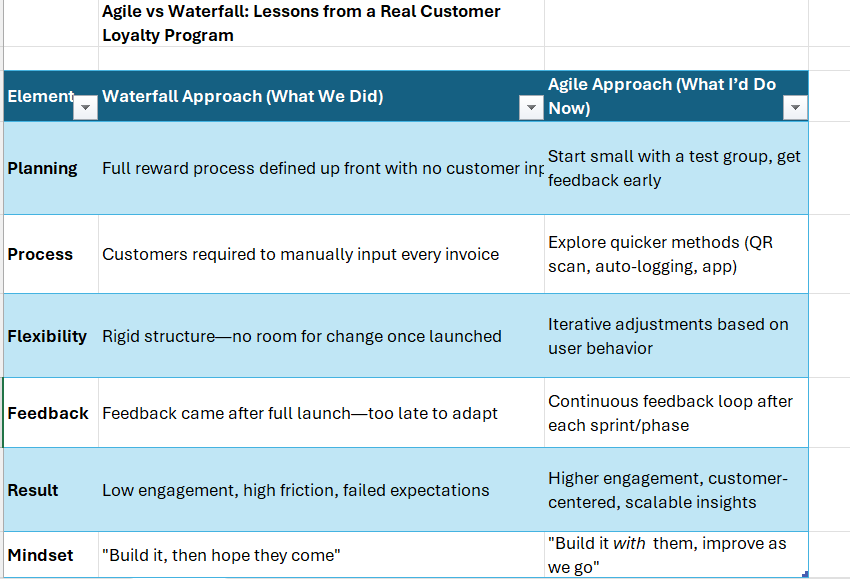

# Agile vs Waterfall – Case Study: Customer Loyalty Program

This real-world case study analyzes how a customer reward initiative failed due to a rigid Waterfall approach—and how Agile thinking could have improved outcomes.

## 🧠 Key Project Elements Compared:
- Planning
- Process Design
- Flexibility
- Feedback Loop
- Result
- Mindset

## 💡 Takeaway:
Agile is more than a software methodology—it’s a mindset for building anything where users are involved.

## 🖼 Visual Chart:

