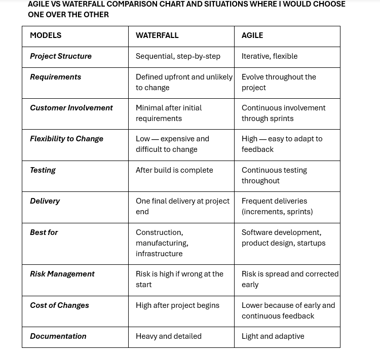
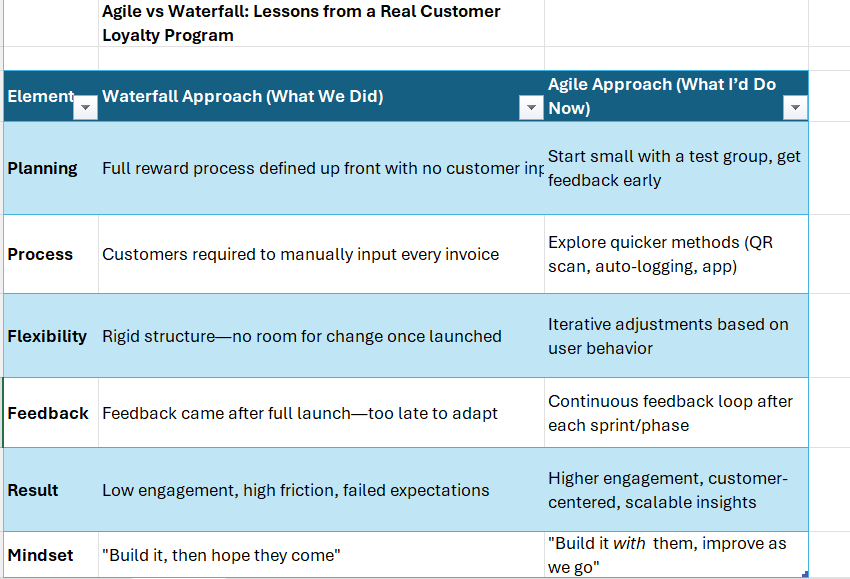

This file contains:

•	A comparison chart between Agile and Waterfall
•	Real-world scenarios where I would apply each methodology
•	Insights from my own experience running customer programs and analysing outcomes

These resources reflect my practical understanding of when to apply Agile thinking—even outside of traditional software 
environments.

Agile vs Waterfall Comparison Chart

This is part of my transition portfolio into Business Analysis, where I share not just what I know—but how I apply it.

Over the course of my career, these are situations where I would have chosen Agile over Waterfall if such situations had 
arisen: 

•	Revamping the customer service workflow (introducing new ticketing processes): 
Reason: One might discover better ways to serve customers as changes are rolled out, so frequent adjustments are useful. 

•	Improving an internal sales support chatbot: 
Reason: The chatbot needs regular feedback from users to improve responses and functionality. Small updates can be made 
often. 

I would have chosen Waterfall over Agile in the following situations: 

•	Setting up a call centre in a new location: 
Reason: Setting up infrastructure (desks, phone lines, schedules) requires clear steps that must happen in sequence.

•	Migrating customer data from an old system to a new one: 
Reason: Data migration projects require a fixed plan, detailed requirements, strict deadlines, and minimal room for changes. 

AGILE VS WATERFALL – CASE STUDY: CUSTOMER LOYALTY PROGRAM:

This real-world case study analyses how a customer reward initiative failed due to a rigid Waterfall approach—
and how Agile thinking could have improved outcomes.

 Key Project Elements Compared:
•	Planning
•	Process Design
•	Flexibility
•	Feedback Loop
•	Result
•	Mindset

Takeaway:

Agile is more than a software methodology—it’s a mindset for building anything where users are involved.

Visual Chart:

